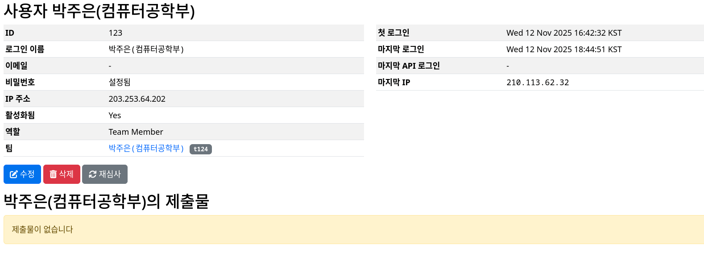

# Domjudge 사용자 관련 도우미

## Too Long, Don't Read

1. 구글 폼 응답을 csv 형태로 `user` 디렉토리에 내려받습니다.
2. `generate.py`를 실행합니다.
3. python 환경에 `requests`를 설치합니다.
4. `add.py`를 실행합니다.

## 기본 구조

손재혁은 **pipelining**을 중요하게 생각합니다. 그래서 구글 신청 폼 응답을 최대한 간단하게 Domjudge에 반영할 수 있도록 노력하였습니다.

* `generate.py`: 구글 폼 응답을 `add.py`에서 사용할 수 있게 변환합니다. 
* `add.py`: [domjudge API 문서](https://ps.gdghufs.com/api/doc)에 나온 명세서를 바탕으로 사용자-팀을 생성합니다. 개인전이 기본이므로 사용자-팀이 1대 1 관계를 가지도록 하였습니다.

### generate.py

이 코드를 실행하면 *STDIN*에서 다음 정보를 요구합니다.

* 구글 폼 응답 csv 파일의 이름(본 디렉토리에 위치해야 함)
* 생성된 csv 파일의 이름(본 디렉토리에 위치하게 될 것임)
* tid 시작 번호

`이름,학과,...` 형태의 csv 파일로부터 `이름(학과),비밀번호,tid` 형태의 csv를 생성합니다. `이름(학과)`가 고유 키 역할을 하며, 만약 중복된 `이름(학과)`가 있는 경우 오류를 출력하되 작업을 멈추지는 않습니다.

비밀번호는 `generate_password`에서 생성합니다. 기본 8글자이며 알파벳, 숫자, 특수문자가 섞입니다. 만약 보안이 보장된 환경이라면 비밀번호는 더 간소화할 수 있을 것입니다.

tid는 domjudge에서 사용하는 표준 팀 id 형식입니다. `t000000` 형식을 따르며, 사용자를 추가할 때마다 초기 값에서 하나씩 값을 올려갑니다.

### add.py

이 코드를 실행하면 *STDIN*에서 다음 정보를 요구합니다.

* csv 파일의 이름(본 디렉토리에 위치해야 함)
* Domjudge url
* Admin name, password
* Contest ID
* 사용자별 IP 접속 제한 여부
* (IP 접속 제한을 설정한 경우) 각 사용자의 IP

> 기술력의 한계로 Admin password를 입력할 때 평문이 보입니다.

**IP를 설정하였는데 다른 IP에서 접속이 되는 이슈가 있습니다. 참고바랍니다.**

`이름(학과),비밀번호,tid` 형태의 csv를 읽어 팀-사용자를 생성합니다. 개인전을 전제하므로 팀, 사용자는 1대 1 관계이며 표시 이름이 똑같게 설정하였습니다.

한 행마다 매번 팀을 먼저 생성하고, 이후 사용자를 생성합니다. 만약 팀이 이미 존재하는 경우, 일단 사용자를 그 팀에 넣습니다. 이후 오류 메시지를 출력하니(프로그램이 멈추지는 않음) 오류 메시지가 출력되었다면 수동으로 확인해야 합니다. 만약 정상적인 절차를 거쳐 `generate.py`를 먼저 실행하였다면 여기서 오류를 출력하고 해당 행을 무시한 csv를 생성하므로, 일반적으로 나타나기는 어렵습니다.

domjudge 관리자 화면에서 dummpy csv 파일의 결과물을 확인할 수 있습니다.
